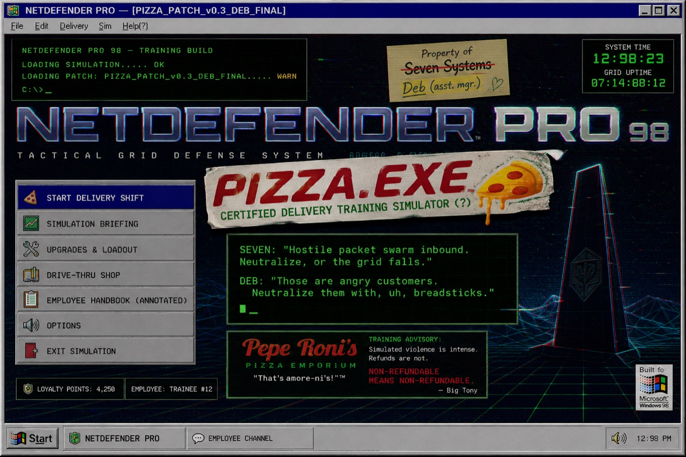

# Spatial Storytelling: Designing Your First WebXR Scene

A ready-to-fork framework for running a **2-hour, hands-on WebXR scene-design workshop** using [A-Frame](https://aframe.io). Participants start from a working scene template, learn the primitives, and leave with a finished, shareable 3D scene they built themselves — viewable in any browser, no VR headset required (though it works in one if you have it). No prior coding, 3D, or game-dev experience is assumed, and nothing needs to be installed: A-Frame loads from a CDN and the whole scene is a single HTML file you can read top to bottom.

Art direction for the workshop asset kit: **PIZZA.EXE**, a military cyberspace simulator wearing a cheap pizza costume. See [asset-kit/](asset-kit/).

---

## Quick start

**See it running right now —** no install, no sign-up:

| | |
|---|---|
| **Live scene** | <https://cmdann.github.io/aframe-workshop-starter/starter-template/> |
| **Workshop site** | <https://cmdann.github.io/aframe-workshop-starter/> |
| **Facilitator slides** | <https://cmdann.github.io/aframe-workshop-starter/slides/> |

**To edit your own copy:**

1. Open <https://glitch.com/edit/#!/import/github/CMDann/aframe-workshop-starter> — this imports this repo into a fresh Glitch project.
2. Hit **Preview**, then navigate to `/starter-template/` on the preview URL.
3. Edit `starter-template/index.html` and the preview reloads as you type.

Glitch is the reference target for editing because it gives you **free HTTPS**, and HTTPS (or `localhost`) is what makes the VR-mode button appear at all — it's a WebXR requirement, not an incidental choice. GitHub Pages satisfies the same requirement, which is why the links above enter VR too.

**No Glitch?** See [docs/deployment.md](docs/deployment.md) for CodeSandbox, GitHub Pages, and a local-server fallback for venues with restrictive networks.

**Running this workshop?** Start with [docs/facilitator-guide.md](docs/facilitator-guide.md), and present from [the slides](https://cmdann.github.io/aframe-workshop-starter/slides/).

---

## Built around the 4 Ds

The session is structured around four moments, in order, rather than as a feature-by-feature software tutorial:

- **Direction** — participants pick a mood, theme, or concept *before* writing anything. Intent comes first.
- **Description** — writing the A-Frame entity tags that describe the scene. This maps unusually literally onto A-Frame's declarative syntax: describing a scene *is* the code.
- **Discernment** — choosing assets deliberately, from the curated kit or self-sourced under a time cap. The skill is judgment about what serves the mood, not how much you can find.
- **Delegation** — A-Frame's defaults (camera rig, look-controls, cursor, lighting) handle the underlying complexity, so participants never touch raw WebXR API code and spend their time on composition instead.

---

## What's in this repo

| Path | What it is |
|---|---|
| [starter-template/](starter-template/) | The fork-ready A-Frame scene participants build from. Heavily commented — it doubles as the in-session reference. |
| [example-scene/](example-scene/) | A finished scene built from the starter template, used as the opening demo. |
| [asset-kit/](asset-kit/) | Curated CC0 models and skyboxes, with a machine-readable manifest and full license attribution. |
| [docs/](docs/) | **Documentation index** — start here for anything written down. |
| [docs/overview.md](docs/overview.md) | What the workshop is, who it's for, and the learning outcomes. |
| [docs/facilitator-guide.md](docs/facilitator-guide.md) | Run of show with clock times, pre-session checklist, common failure points and fixes. |
| [docs/assignment.md](docs/assignment.md) | The student-facing task brief, requirements, and asset-sourcing rules. |
| [docs/student-cheatsheet.md](docs/student-cheatsheet.md) | One-page, print-friendly A-Frame quick reference. |
| [docs/deployment.md](docs/deployment.md) | Glitch / CodeSandbox / GitHub Pages / local fallback instructions. |
| [docs/aframe/](docs/aframe/) | A guide to A-Frame from zero — concepts through VR, beyond what the session covers. |
| [docs/process/](docs/process/) | How this repo was built, its architecture, and the contributing workflow. |
| [docs/decisions.md](docs/decisions.md) | Judgment calls made while building this, and open items. |
| [slides/](slides/) | The facilitator deck (reveal.js). |

## Running this yourself

This is designed to be picked up and run by *any* facilitator — that's the point of open-sourcing it. Nothing here is tied to a particular institution. Fork it, swap the asset kit for one that suits your group, and adapt the timings.

## Contributing

See [CONTRIBUTING.md](CONTRIBUTING.md). The short version: no build step, no npm install, single-file scenes, and every bundled asset needs a verifiable CC0 or CC-BY license.

## License

[MIT](LICENSE) for the framework code and documentation — fork it, adapt it, run it commercially.

**The assets are separate.** The PIZZA.EXE models, concept art and world bible in `asset-kit/` are © 2026 Dann Blair, all rights reserved, and licensed for **workshop use only**: build and publish whatever you like with them in a workshop scene, but don't redistribute them standalone or ship them in other products. Full terms in [asset-kit/LICENSE-ASSETS.md](asset-kit/LICENSE-ASSETS.md).
